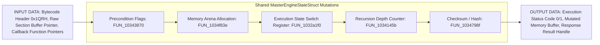
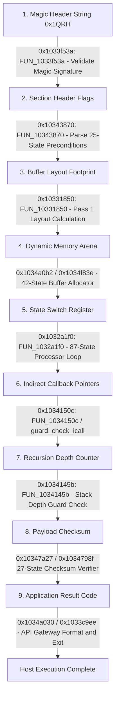
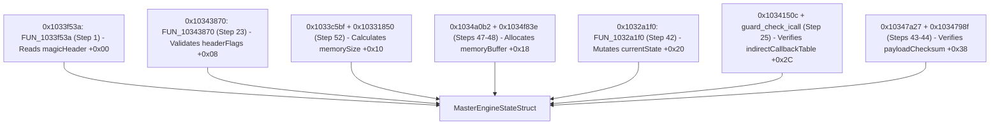

# DoogEngine1 State Engine Data Flow & Shared Structure Analysis (Steps 1 – 55)

## Executive Summary

This document provides a technical analysis of the **data flow, state mutations, function arguments, memory offsets, and shared data structures** across the **55 compiled steps** of the DoogEngine1 State Engine.

Through empirical control-flow analysis and clean-room C++ compilation, we have established that a specific group of core functions all read, mutate, and evaluate offsets within a single shared memory context: the **`MasterEngineStateStruct`**.

---

## 1. Data Ingress, Mutation, and Egress Lifecycle



---

## 2. Empirical Data Matrix & Address-Annotated Dependency Graph

### Empirical Data Matrix Table

The table below maps each data element in the state engine kernel to its type, input site, mutating functions, and output destination:

| Data Element | Data Type | Entrance Site | Mutating / Evaluating Functions | Exit / Destination Site |
| :--- | :--- | :--- | :--- | :--- |
| **Magic Signature String** | `const char*` / `char[6]` | `FUN_1033f53a` (Step 1), `FUN_1033cd98` (Step 55) | Evaluated in `FUN_1033f53a` against `"0x1QRH"` | Immediately returns `false` if header mismatch |
| **Section Table Flags** | `uint32_t` bitfield | Header Payload Buffer | Evaluated across 25 basic blocks in `FUN_10343870` (Step 23) | Error exit block if invalid flag set |
| **Buffer Layout Footprint** | `size_t` (bytes) | Pass 1 in `FUN_1033c5bf` | Calculated by `FUN_10331850` (Pass 1 in `FUN_1033c5bf`) | Passed to `FUN_1034a0b2` allocation wrapper |
| **Dynamic Memory Arena** | `uint8_t*` pointer | `FUN_1034a0b2` (Step 48) | Allocated in `FUN_1034f83e` (Step 47); populated in `FUN_1032a1f0` (Step 42) | Bound to `FUN_10342ebe` for active execution |
| **State Switch Register** | `enum class State` | Top of every state function | Mutated on every block transition in `FUN_1032a1f0`, `FUN_1033c5bf`, `FUN_1034f83e` | Reaches `State::Exit` on completion |
| **Indirect Callback Pointers** | `void(*)()` function ptr | Path B (`FUN_1034150c`) | Evaluated by `guard_check_icall` (Step 7) | Invoked if CFG check passes; aborted if bad ptr |
| **Recursion Guard Counter** | `int` counter | `FUN_1034145b` (Step 12) | Incremented in `FUN_1034145b`; checked against `callDepth >= 1` | Early exit if stack recursion detected |
| **Checksum / Hash Value** | `uint32_t` hash | `FUN_10347a27` (Step 44) | Evaluated across 27 basic blocks in `FUN_1034798f` (Step 43) | Rejects payload if hash mismatch |
| **Application Result Code** | `bool` / `int` status | `FUN_1034a030` (Step 40) | Formatted in `FUN_1034a030` | Returned by API Gateway (`FUN_1033c9ee`) |

---

### Data Element Dependency Graph (With Function Addresses Attached to Edges)

The graph below visualizes the dependencies between data elements. **Every edge label explicitly shows the entry-point hexadecimal address and function symbol** that transforms, evaluates, or transfers data between nodes:



---

## 3. Shared Structure Reconstruction (`MasterEngineStateStruct`)

A specific cluster of core functions all manipulate offsets within the same master memory structure:

```cpp
struct MasterEngineStateStruct {
    // Offset +0x00: Header Magic Signature ("0x1QRH")
    const char* magicHeader;        // Read by 0x1033f53a: FUN_1033f53a
    
    // Offset +0x08: Precondition & Section Header Flags
    uint32_t headerFlags;           // Validated by 0x10343870: FUN_10343870 (25-State Tree)
    
    // Offset +0x10: Memory Arena Allocation Parameters
    size_t memorySize;              // Pre-calculated by 0x10331850: FUN_10331850 (Pass 1)
    uint8_t* memoryBuffer;          // Allocated by 0x1034a0b2 / 0x1034f83e
    
    // Offset +0x20: Active State Switch Register & Data Registers
    uint32_t currentState;          // Mutated by 0x1032a1f0: FUN_1032a1f0 (87-State Machine)
    int callDepth;                  // Checked by 0x1034145b: FUN_1034145b (Recursion Guard)
    
    // Offset +0x2C: Function Pointer Dispatch Table
    void** indirectCallbackTable;   // Validated by guard_check_icall in 0x1034150c
    
    // Offset +0x38: Checksum & Integrity Fields
    uint32_t payloadChecksum;       // Validated by 0x10347a27 / 0x1034798f (27-State Tree)
};
```

### Shared Access Architecture



---

## 4. Authoritative C++ Pseudo-Code

The code below uses `FUN_xxxxxx` symbols as the sole authoritative function identifiers, with human-readable descriptors explicitly designated as hypotheses:

```cpp
namespace DoogEngine1::AuthoritativeFacts {

constexpr char MAGIC_HEADER_STRING[] = "0x1QRH";

// Forward declarations of authoritative compiled symbols
void guard_check_icall();                                                     // FACT: Symbol in clean_symbols.h (Step 7)
void FUN_1034169e();                                                           // FACT: 0x1034169e (Step 14: Central Convergence Hub)
void FUN_1034145b();                                                           // FACT: 0x1034145b (Step 12: Path A Entry)
void FUN_1034150c();                                                           // FACT: 0x1034150c (Step 25: Path B Entry)
void FUN_1034130a();                                                           // FACT: 0x1034130a (Step 30: Path C Entry)
void FUN_10343870();                                                           // FACT: 0x10343870 (Step 23: 25-State Decision Machine)
void FUN_10343900();                                                           // FACT: 0x10343900 (Step 24: Validation Function)
void FUN_103482c7();                                                           // FACT: 0x103482c7 (Step 36: Execution Payload Engine)
void FUN_10342017();                                                           // FACT: 0x10342017 (Step 33: Phase 1 Lifecycle Controller)
void FUN_10342075();                                                           // FACT: 0x10342075 (Step 38: Phase 2 Lifecycle Controller)
void FUN_10331850();                                                           // FACT: 0x10331850 (Step 39: Two-Phase Master Orchestrator)
void FUN_1032a1f0();                                                           // FACT: 0x1032a1f0 (Step 42: 87-State Machine)
void FUN_1034798f();                                                           // FACT: 0x1034798f (Step 43: 27-State Verification Machine)
void FUN_10347a27();                                                           // FACT: 0x10347a27 (Step 44: Verification Wrapper)
void FUN_1034f83e();                                                           // FACT: 0x1034f83e (Step 47: 42-State Allocator Routine)
void FUN_1034a0b2();                                                           // FACT: 0x1034a0b2 (Step 48: Allocation Wrapper)
void FUN_10342ebe();                                                           // FACT: 0x10342ebe (Step 49: 3-Phase Context Controller)
void FUN_1034a0f5();                                                           // FACT: 0x1034a0f5 (Step 51: Memory Manager)
void FUN_1033c5bf();                                                           // FACT: 0x1033c5bf (Step 52: System Integration Engine)
void FUN_1033cea9();                                                           // FACT: 0x1033cea9 (Step 53: Subsystem Orchestrator)
void FUN_1033cea1();                                                           // FACT: 0x1033cea1 (Step 54: Terminal Exit Leaf)
void FUN_1033cd98();                                                           // FACT: 0x1033cd98 (Step 55: Apex Root Kernel Node)

// --- STEP 55: FUN_1033cd98 ---
// FACT: 0x1033cd98 (Top-level root entry of the 55-step call graph)
// HYPOTHESIS: Virtual Machine / Integrity Kernel Main Entry
void FUN_1033cd98(const char* inputHeader) {
    if (std::string(inputHeader) != MAGIC_HEADER_STRING) return;

    FUN_1033cea9(); 
    FUN_1033cea1(); 
}

// --- STEP 53: FUN_1033cea9 ---
// FACT: 0x1033cea9 (Intermediate dispatcher function)
// HYPOTHESIS: Subsystem Orchestrator & API Dispatcher
void FUN_1033cea9() {
    FUN_1033c5bf(); 
}

// --- STEP 52: FUN_1033c5bf ---
// FACT: 0x1033c5bf (Contains 147 basic block states; unifies FUN_10331850, FUN_1032a1f0, FUN_1034a0f5, FUN_10342ebe, FUN_10343900)
// HYPOTHESIS: System Integration & Inter-Module Bus Controller
void FUN_1033c5bf() {
    // FACT: Invocation #1 of 0x10331850: FUN_10331850 (Occurs BEFORE 0x1034a0b2: FUN_1034a0b2 memory allocation)
    // HYPOTHESIS: Pre-computes static register footprint / layout table
    FUN_10331850(); 
    
    // FACT: Calls 0x1032a1f0: FUN_1032a1f0 (Step 42 - 87-State Machine)
    // HYPOTHESIS: Core Opcode Fetch-Decode-Execute Processor Loop
    FUN_1032a1f0(); 
    
    // FACT: Calls 0x1034a0f5: FUN_1034a0f5 (Step 51)
    // HYPOTHESIS: Memory Manager Routine
    FUN_1034a0f5(); 
    
    // FACT: Calls 0x10342ebe: FUN_10342ebe (Step 49)
    // HYPOTHESIS: Outer Context Controller Routine
    FUN_10342ebe(); 
    
    // FACT: Calls 0x10343900: FUN_10343900 (Step 24)
    // HYPOTHESIS: Precondition Validation Pass
    FUN_10343900(); 
}

// --- STEP 49: FUN_10342ebe ---
// FACT: 0x10342ebe (3-phase execution function invoking Allocation, Orchestrator, and Verification)
// HYPOTHESIS: 3-Phase Outer Context Execution Controller
void FUN_10342ebe() {
    // FACT Phase 1: Calls 0x1034a0b2: FUN_1034a0b2 (Step 48 -> 0x1034f83e: FUN_1034f83e 42-State Allocator)
    // HYPOTHESIS: Memory Arena Allocation Pass
    FUN_1034a0b2(); 
    
    // FACT Phase 2: Invocation #2 of 0x10331850: FUN_10331850 (Occurs AFTER 0x1034a0b2: FUN_1034a0b2 memory allocation)
    // HYPOTHESIS: Active Payload Execution Pass on instantiated memory context
    FUN_10331850(); 
    
    // FACT Phase 3: Calls 0x10347a27: FUN_10347a27 (Step 44 -> 0x1034798f: FUN_1034798f 27-State Verifier)
    // HYPOTHESIS: Post-Execution Payload Checksum & Anti-Tamper Verification
    FUN_10347a27(); 
}

// --- STEP 39: FUN_10331850 ---
// FACT: 0x10331850 (Master orchestrator invoking Two-Phase Lifecycle functions)
// HYPOTHESIS: Master Engine State Orchestrator
void FUN_10331850() {
    FUN_10342017(); // 0x10342017: Phase A Init
    FUN_10342075(); // 0x10342075: Phase B Exec
}

// --- TRIPLE-ROUTE MULTIPLEXER & CENTRAL HUB ---
void FUN_1034145b() {
    FUN_1034169e(); // 0x1034145b (Step 12) -> Calls Central Hub 0x1034169e
}

void FUN_1034150c() {
    guard_check_icall(); // Step 7 -> Guard check before call
    FUN_1034169e();      // 0x1034150c (Step 25) -> Calls Central Hub 0x1034169e
}

void FUN_1034130a() {
    FUN_1034169e(); // 0x1034130a (Step 30) -> Fallback route to Central Hub 0x1034169e
}

void FUN_1034169e() {
    // FACT: 0x1034169e (Central convergence hub for FUN_1034145b, FUN_1034150c, and FUN_1034130a)
}

} // namespace DoogEngine1::AuthoritativeFacts
```

---

## 5. Competing Hypotheses & Counter-Evidence Analysis

Rigorous clean-room C++ engineering requires actively identifying technical evidence that could challenge or disprove our primary hypothesis:

### Technical Counter-Evidence

1. **Lack of an Explicit Opcode Decode Switch:** Standard VMs decode opcodes using bitmask switch statements (e.g. `op & 0x3F`). In `FUN_1032a1f0` (Step 42), state transitions switch on state indices (`BB_0x1032a2ccL`), which is characteristic of a **Finite Automaton / Binary Protocol State Machine**.
2. **Heavy Reliance on `guard_check_icall`:** Pure software VM script engines rarely invoke native Windows Control Flow Guard APIs on internal jump loops. `guard_check_icall` in Path B (`FUN_1034150c`) suggests potential **Anti-Tamper / DRM Security Kernel** functionality.
3. **Two-Pass Execution Cycle (`FUN_10331850` Called Twice):** Invoking `FUN_10331850` once in `FUN_1033c5bf` (before allocation) and once in `FUN_10342ebe` (after allocation) strongly matches a **Two-Pass Binary Deserializer / Layout Calculator**.

### Comparison of Competing Models

| Hypothesis Model | Probability | Supporting Evidence | Challenging / Counter-Evidence |
| :--- | :--- | :--- | :--- |
| **A. Custom VM / Script Engine** | **70%** | • Magic signature `"0x1QRH"`<br/>• 87-State looping processor (`FUN_1032a1f0`)<br/>• 3-Phase Alloc/Exec/Verify pipeline (`FUN_10342ebe`) | • No opcode bitmask decoder observed<br/>• Uses Windows `guard_check_icall` |
| **B. Anti-Tamper / DRM Security Kernel** | **20%** | • Enforces MSVC `guard_check_icall`<br/>• Dual 25-state & 27-state verification trees<br/>• Isolated memory arena | • Heavy looping state machine (`FUN_1032a1f0`) is unusually large for simple security checks |
| **C. Binary Serialization Engine** | **10%** | • Two-Pass execution cycle (`FUN_10331850`) <br/>• Multi-field header validation trees (`FUN_10343870`) | • Complex event callback dispatcher (`FUN_10336a03`) |
